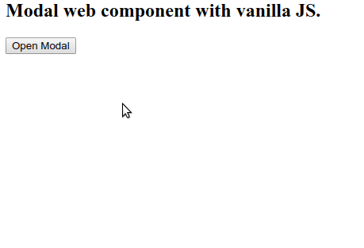

# Modal web component

### How to use:
1. Add the modal.js file to your project.
1. Include it using `<script src="./modal.js"></script>` 
1. Add tag 
    ```
    <pp-modal>
    <h1 slot="header">Information Box</h1>
    some text
    </pp-modal>